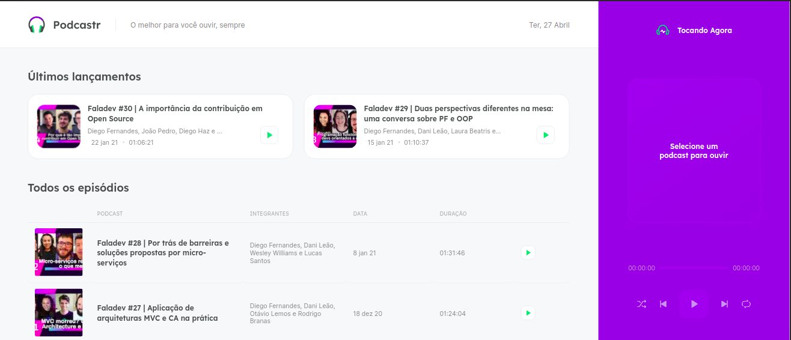

# Podecastr

Mais um projeto brilhante desenvolvido pela Rocketseat na Next Level Week 5!

## Tecnologias utilizadas
- Typescript
- React JS
- NextJS

## Objetivo do projeto
- Ouça seus podcasts favoritos utilizando essa bela aplicação
- Acrescentar mais um projeto para um portifólio completo

## Aprendizados
- Contextos no React
- Componentização no React
- Alimentando a aplicação utilizando uma api (fake api)
- Estilizando a aplicação com SCSS modules
- Familiarização com NextJS

## Mais algumas imagens da aplicação

- Podcast rodando na homepage

- Post com resumo do podcast e o podcast rodando ao lado

